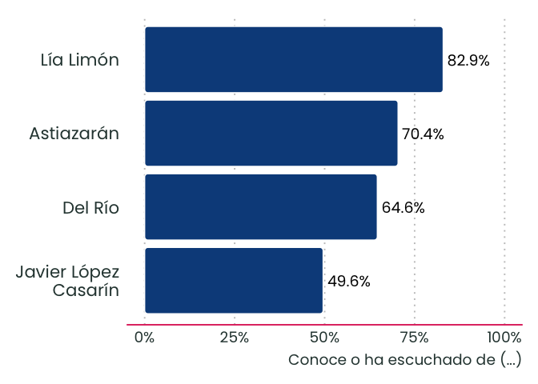
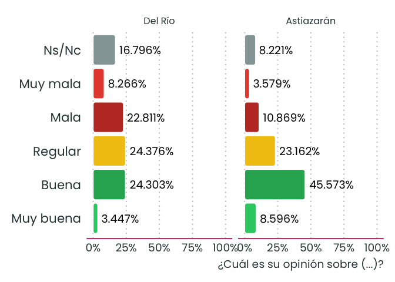
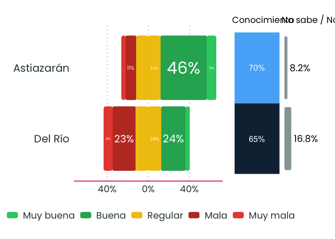

<!-- README.md is generated from README.Rmd. Please edit that file -->

``` r
library(morantviz)
library(ggplot2)
```

``` r
data("dicc")
data("colores")
data("diseno_demo")
data("tema_morant")
```

``` r
g <- Encuesta$new(diseno = diseno_demo,
                  diccionario = dicc,
                  colores = colores,
                  color_principal = "pink",
                  tema = tema_morant())
```

# conocimiento barras horizontal ——————————————

``` r
g$
  contar_variables(variables = c("conoce_pm_astiazaran", "conoce_pm_delrio", "conoce_pm_lia", "conoce_pm_javier"), confint = F)$
  filtrar_respuesta(valor = "Sí")$
  pegar_diccionario()$
  pegar_color()$
  envolver_etiquetas(columna = "nombre", ancho = 13)$
  # reordenar_columna(columna = "nombre", tipo = "manual", "Astiazarán", after = 1)
  reordenar_columna(columna = "nombre", tipo = "asc")

g$tbl
#> # A tibble: 4 × 7
#>   respuesta media     ee codigo               nombre              pregunta color
#>   <chr>     <dbl>  <dbl> <chr>                <fct>               <chr>    <chr>
#> 1 Sí        0.496 0.0178 conoce_pm_javier     "Javier López\nCas… Conoce … #0c4…
#> 2 Sí        0.646 0.0165 conoce_pm_delrio     "Del Río"           Conoce … #0c4…
#> 3 Sí        0.704 0.0150 conoce_pm_astiazaran "Astiazarán"        Conoce … #0c4…
#> 4 Sí        0.829 0.0128 conoce_pm_lia        "Lía Limón"         Conoce … #0c4…

g$graficar_barras_h(x = "nombre")
```



# opinión barras facet —————————————————-

``` r
g$
  contar_variables(variables = c("opinion_pm_astiazaran", "opinion_pm_delrio"), confint = F)$
  pegar_diccionario()$
  pegar_color()$
  reordenar_columna(columna = "respuesta", tipo = "manual", c("Muy buena", "Buena", "Regular", "Mala", "Muy mala", "Ns/Nc"))$
  reordenar_columna(columna = "nombre", tipo = "manual", c("Del Río", "Astiazarán"))

g$graficar_barras_h(x = "respuesta") +
  facet_wrap(~nombre)
```



# opinión barras divergente ————————————————

``` r
g$
  contar_variables(variables = c("opinion_pm_astiazaran", "opinion_pm_delrio"), confint = F)$
  filtrar_respuesta(valor = c("Muy buena", "Buena", "Regular", "Mala", "Muy mala"))$
  pegar_diccionario()$
  pegar_color()$
  reordenar_columna(columna = "respuesta", tipo = "manual", c("Muy buena", "Buena", "Regular","Mala","Muy mala"))$
  partir_regular(opcion = "Regular")$
  cambiarSigno_media(negativo = c("Mala", "Muy mala"))$
  reordenar_columna(columna = "nombre", tipo = "suma")$
  etiquetar_regular(regular = "Regular")

g$tbl
#> # A tibble: 12 × 9
#>    respuesta   media      ee codigo    nombre pregunta color respuesta2 etiqueta
#>    <fct>       <dbl>   <dbl> <chr>     <fct>  <chr>    <chr> <chr>      <chr>   
#>  1 Buena      0.456  0.0187  opinion_… Astia… ¿Cuál e… #27a… Buena      "46%"   
#>  2 Mala      -0.109  0.0118  opinion_… Astia… ¿Cuál e… #c03… Mala       "11%"   
#>  3 Muy buena  0.0860 0.0116  opinion_… Astia… ¿Cuál e… #2ec… Muy buena  "9%"    
#>  4 Muy mala  -0.0358 0.00594 opinion_… Astia… ¿Cuál e… #e74… Muy mala   "4%"    
#>  5 Buena      0.243  0.0175  opinion_… Del R… ¿Cuál e… #27a… Buena      "24%"   
#>  6 Mala      -0.228  0.0178  opinion_… Del R… ¿Cuál e… #c03… Mala       "23%"   
#>  7 Muy buena  0.0345 0.00902 opinion_… Del R… ¿Cuál e… #2ec… Muy buena  "3%"    
#>  8 Muy mala  -0.0827 0.0109  opinion_… Del R… ¿Cuál e… #e74… Muy mala   "8%"    
#>  9 Regular    0.116  0.0167  opinion_… Astia… ¿Cuál e… #f1c… Regular    "23%"   
#> 10 Regular    0.122  0.0179  opinion_… Del R… ¿Cuál e… #f1c… Regular    "24%"   
#> 11 Regular   -0.116  0.0167  opinion_… Astia… ¿Cuál e… #f1c… Regular2   ""      
#> 12 Regular   -0.122  0.0179  opinion_… Del R… ¿Cuál e… #f1c… Regular2   ""
g$graficar_barras_divergente(regular = "Regular",
                             positivas = c("Buena", "Muy buena"),
                             negativas = c("Mala", "Muy mala"))
#> Warning: Stacking not well defined when not anchored on the axis
```


# opinon + conocimiento + ns_nc

``` r
g$saldos_opinion(sufijo_opinion = "opinion_pm",
                 cat_ns_nc = "Ns/Nc",
                 sufijo_conoce = "conoce_pm",
                 cat_conoce = "Sí",
                 actores = c("astiazaran", "delrio"),
                 positivas = c("Muy buena", "Buena"),
                 negativas = c("Mala", "Muy mala"),
                 regular = "Regular")
#> Warning: Stacking not well defined when not anchored on the axis
```


